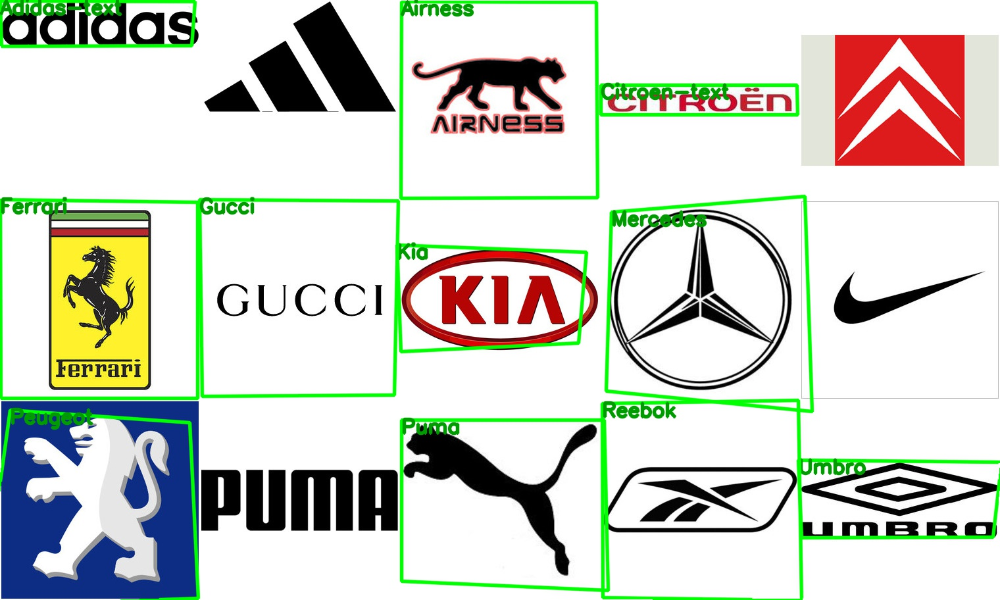

# Brand recognition with the BelgaLogos dataset

The
[BelgaLogos](http://www-sop.inria.fr/members/Alexis.Joly/BelgaLogos/BelgaLogos.html)
dataset consists of 10,000 images from the [Belga](http://www.belga.be/) press
agency, annotated with the location and name of brand logos appearing in the
images. In total annotations for 26 separate logos are provided in the dataset,
covering a variety of businesses.

In this repository I study how this dataset can be applied to the training of a
logo-classification model, specifically targeting the subset of BelgaLogo
entries from automotive and fashion brands.

The analysis is mostly documented in [Jupyter](http://jupyter.org/) notebooks,
which document my analysis procedure step-by-step in detail. This repository is
not meant only as a store of results, but also as a record of the
thought-process followed in the analysis. 

## Contents

### Exploration of the dataset
1. [Parsing and basic data validation](parsing.ipynb)
2. [Initial study of the logo bounding-boxes](boundingboxes.ipynb)
3. [The automotive and fashion brand dataset](dataset.ipynb)

### Model survey and feasibility study
1. [Survey of model options](model_survey.ipynb)
2. [Keypoint matching feasibility study](keypoint_study.ipynb)

### Implementation and validation
1. [Implementation of model](implementation.ipynb)
2. [Validation framework](validation_framework.ipynb)
3. [Validation of model (a): Collage of logos](collage_validation.ipynb)
4. [Validation of model (b): BelgaLogos dataset](belgalogos_validation.ipynb)
4. [Validation of model (c): BelgaLogos dataset, alternative templates](belgalogos_live_validation.ipynb)

### Wrapping things up
1. [Conclusion and summary](summary.md)

## Running the model
Included in this repository is a stand-alone version of the model which can be
run on your own test images. It requires:

 - numpy
 - matplotlib
 - scikit-learn
 - OpenCV

Running it should be as simple as cloning this repository, and running (from the root directory of the repo):

```Shell
    ./run_model.py [training_set] <image filename1> ... <image filename N>
```

where `[training_set]` can be either `logos` (which trains the model on 'ideal'
versions of the logos) or `live_logos` (which trains the model on photographs of
the logos).

Here's an example:
```Shell
    ./run_model.py logos data/logos/collage.jpeg
```



## Running the notebooks

The notebooks require the following python packages:
 - numpy
 - matplotlib
 - scikit-learn
 - beautifulsoup4 + lxml
 - OpenCV2
 - pillow

To fetch the source data for the analysis, run `data/getdata.sh` which will
download and decompress the BelgaLogos dataset images. 

**Note: this is a moderately large dataset (~1GB)**.
