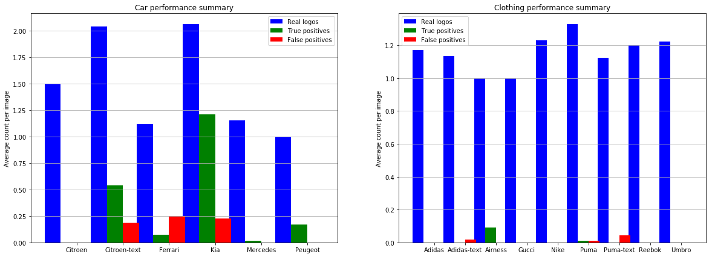
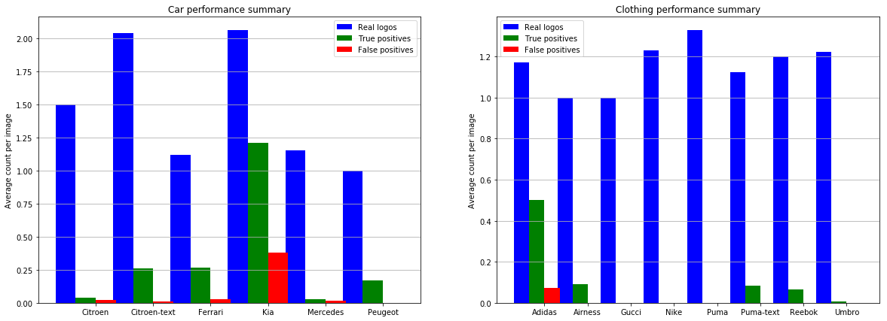

# Summary and conclusions
The challenge for this repository was to build, in a week, a model for the
classification of automotive and fashion brand logos. This was to be
accomplished using the BelgaLogos dataset of images with logo position and
identification annotations. Here I will summarise the week and the various
stages of the investigation and implementation.

## Initial investigations
I began the week by performing some basic investigations into the dataset and
annotations provided by BelgaLogos. These investigations included:

#### Parsing and verifying the annotations provided in the dataset.
The original dataset had some minor text-formatting problems which prevented the
automatic parsing of the input data. These were fixed, and the parsed results
were validated against counts from the BelgaLogos website (scraped with
BeautifulSoup4).

#### Verifying the bounding-box annotations
The BelgaLogos dataset stores information on the position of logos within an
image as *bounding-boxes*. I performed a number of cross-checks against these
bounding-boxes and discovered some irregularities. Namely that some of the
bounding-box sizes exceeded limits stated on the BelgaLogos dataset. Annotations
corresponding to these bounding-boxes were cut from the dataset. I then examined
a few examples of the bounding-boxes to verify that they were correctly
describing logos.

#### Examining the automotive and fashion datasets
As car and clothing brands form only a subset of the total BelgaLogos dataset, I
performed a quick study of the relevant data. This included counts of which
images are considered good-quality (labelled 'OK' in the dataset), and a quick
check of the typical sizes of the logos in this dataset.

## Deciding on a model
Now that I had a reasonable feel for the available data, the next stage of the
challenge was to decide upon a suitable model. I performed a quick survey of
different options, concluding that a 'keypoint-matching' model was most likely
to yield a working classifier within the time constraints. This was on the
grounds of:

1. **Dataset size:** the car and clothing subset of the BelgaLogos dataset is
   not particularly large. Some brands having less than ten annotated images for
   training. Without more involved approaches (i.e artificial data synthesis),
   this dataset would not be suitable for use with modern state-of-the-art
   classifiers.

2. **Dataset quality:** the quality of the annotated logos in the BelgaLogos
   dataset varies considerably. Firstly several of the images are significantly
   occluded or blurred. Secondly some logo annotations actually label a class of
   different logos (brightness-inverse logos, different shape logos) and so
   make up an inconsistent set of training data.

Keypoint-matching requires neither a large-dataset nor that test images be
clearly visible (it works fine with partially occluded objects). Therefore I
decided to test the method with a small feasibility study.

#### Feasibility study
Before committing to the method, I performed a quick check that a
keypoint-matching methodology could work on a test image. This study
demonstrated that a specific combination of procedures (SIFT keypoints,
MeanShift clustering, brute-force matching) yielded good results on the test
image. I therefore decided to continue with a full implementation of this
specific procedure.

## Implementation and validation
Having shown that the keypoint matching idea was feasible, I implemented a
self-contained version of the feasibility analysis that could handle more than
one logo at once. To test the implementation and the keypoint matching in
general, a validation framework was required.

#### Validation strategy
In order to validate the results, I wrote a rough algorithm for matching
detected results to annotations in the BelgaLogos dataset. In this way,
true/false positive counts could be estimated.

#### Validation stage one
The keypoint matching model is trained on 'ideal' versions of the brand logos
rather than directly on the dataset. The first stage of validation was therefore
to ensure that the logos used for training the classifier *could detect
themselves*. To check this I made a collage of the training logos, and applied
the classifier to it. These were the results:

While most of the images were successfully classified, interestingly, some
failed. These logos may have some features that make keypoint-matching very
difficult. Understanding why would take further study (and more time than is
available to me!).

#### Validation stage two
Finally I checked the classifier against the whole BelgaLogos car and clothing
logo dataset. The image below summarises the performance on the car (left) and
clothing (right) datasets. For each brand, I show the number of true positives
(green), false positives (red) and the 'truth' logo count (blue). All numbers
are normalised to the number of images for each brand.

For a first implementation, not too bad! The method clearly generalises to other
logos, although efficiency is very low. The clothing dataset is particularly
challenging. Typically these logos form a *very small* part of the total image,
and they are often significantly distorted.

In order to see if more representative training-logos would improve performance,
I trained the model on example images from the BelgaLogos dataset itself (rather
than 'ideal' logos). The below tables summarise the results from the study with
'live' training images.

There are clear improvements for several logos, most notably in Ferrari and
Adidas. I believe that more improvements could be found by further tuning and
study of the template logos.

## Conclusion and directions for improvement
I'm happy to have constructed a detector that can achieve correct matches on
such a challenging dataset. In the process I have learned a great deal in terms
of Machine Vision by performing a survey of possible approaches, and
getting to grips with the details of a keypoint-matching model.

The model I have constructed is still very basic, and performance could be
improved in several directions. As a few examples:

- The clustering stage in the keypoint-matching means that large logos can fail
  to be detected due to the logos being broken into separate clusters. This could be
  improved by using a 'pyramid' or 'cascade' model, where the test image is
  progressively scaled down and re-analysed.
- The detection of logos depends strongly on how representative the template
  logo is. This could be improved by using a stack of template images taken in
  different contexts.
- These improvements would require speeding-up the classifier. This could be
  straightforwardly done by replacing the 'brute-force' matching with an
  approximate version (based on approximate k-nearest-neighbours).

